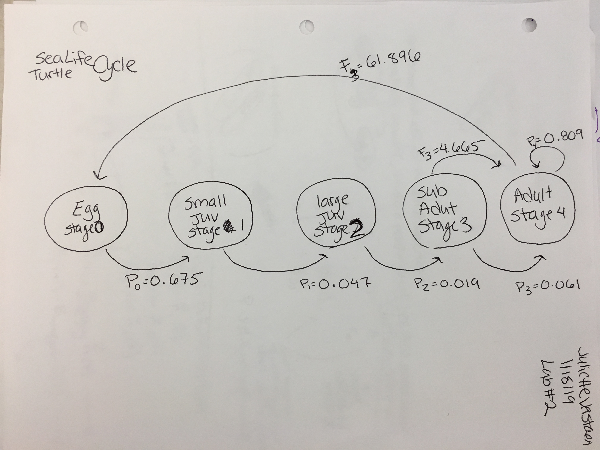

```{r setup, include=FALSE}
knitr::opts_chunk$set(echo = TRUE)
```

```{r}

library(devtools)
devtools::install_github("BruceKendall/PVA")
devtools::install_github("BruceKendall/mpmtools")

```
#1. Enter Matrix model

creating matrix
```{r}

A <- matrix(c(0,     0,     0,     4.665, 61.896,
              0.675, 0.703, 0,     0,      0,
              0,     0.047, 0.657, 0,      0,
              0,     0,     0.019, 0.682,  0,
              0,     0,     0,     0.061,  0.809),
          nrow = 5, ncol = 5, byrow = TRUE)

```

giving matrix row and/or column names
below is naming by column, if wanted to name by row would have to use byrow=FALSE
```{r}

class_names <- c("Egg", "Sm Juv", "Lg Juv", "Subadult", "Adult")
A <- matrix(c(0,     0,     0,     4.665, 61.896,
              0.675, 0.703, 0,     0,      0,
              0,     0.047, 0.657, 0,      0,
              0,     0,     0.019, 0.682,  0,
              0,     0,     0,     0.061,  0.809),
          nrow = 5, ncol = 5, byrow = TRUE, dimnames = list(class_names, class_names))

```

Life Cycle 
```{r}
library(knitr)

```


#1.1 Matrix Conventions

- RC Cola: indexed first by *R*ow and then by *C*olumn
- *A* capital bold letters are matrices and *n* lower case are vectors
- use brackets to return the elements you want to look at. example = A[4,3] element in 4th row and 3rd column

```{r}

A

A[4,3]
A[,3]
A[4,]
A[, c(3,5)]
A[3:4, 3]


```

#2. Projecting the population matrix

```{r}

library(popbio)

# Initial abundance
n_0 <-c(1000, 10, 10, 10, 10)

# Project the matrix
pop <- pop.projection(A, n_0, iterations = 10)

# Plot each stage through time
stage.vector.plot(pop$stage.vector)

#these are proportions in each stage through time

```

Actual abundances through time
```{r}
 
stage.vector.plot(pop$stage.vector, proportions = FALSE)

```
This graph shows the number of turtles in each stage class over 10 years.


```{r}

plot(pop$pop.sizes, type = "l")

plot(pop$pop.changes, type = "l")

```
The population size is going down, which we could tell from the previous graphs that are seperated out by stage classes
The changes in population is going down also whcih corresponds to the decrease in populaiton size


###plot proportions in log to see if reaching stable
- they are not fully straight yet at 10 years so not stable

- when project out to 50 years you can tell that year 10 is when they start to be stable


```{r}
stage.vector.plot(pop$stage.vector, log = "y")

pop_50 <- pop.projection(A, n_0, iterations = 50)

# Plot each stage through time
stage.vector.plot(pop_50$stage.vector)
stage.vector.plot(pop_50$stage.vector, log = "y")

```
- Plotting out to 50 years we can see that the populations become more stable at each time stage

-It seems that 10 years out is when the populaiton begins to stable

- The log version of out graph confirms that sometime after 10 years the population is reaching a stable state because they are straight


#3. Analyzing the population matrix
SSD (stable stage distribution)

```{r}

lambda(A)
stable.stage(A)

pop_50

```
Comparing lambda and the population vector are different because:

1. lambda and stable.stage project out to as far as needed to reach stable asymptotic (goes out as many years as needs to)

2. when we call to pop_ something it is only looking at until the number of iterations/years that we ran it


#Informating management decisions for turtle conservation

```{r}

#increase egg survival
class_names <- c("Egg", "Sm Juv", "Lg Juv", "Subadult", "Adult")
egg_increase <- matrix(c(0,     0,     0,     4.665, 61.896,
              0.9, 0.703, 0,     0,      0,
              0,     0.047, 0.657, 0,      0,
              0,     0,     0.019, 0.682,  0,
              0,     0,     0,     0.061,  0.809),
          nrow = 5, ncol = 5, byrow = TRUE, dimnames = list(class_names, class_names))

# Initial abundance
n_0_egg <-c(1000, 10, 10, 10, 10)

# Project the matrix
pop_egg <- pop.projection(egg_increase, n_0_egg, iterations = 50)

# Plot each stage through time
stage.vector.plot(pop_egg$stage.vector, proportions = FALSE)

lambda(egg_increase)

###increasing egg survival does not seem to matter much


#increase egg survival
class_names <- c("Egg", "Sm Juv", "Lg Juv", "Subadult", "Adult")
adults_increase <- matrix(c(0,     0,     0,     4.665, 61.896,
                        0.675, 0.703, 0,     0,      0,
                         0,     0.047, 0.657, 0,      0,
                         0,     0,     0.019, 0.682,  0,
                         0,     0,     0,     0.061,  0.9),
          nrow = 5, ncol = 5, byrow = TRUE, dimnames = list(class_names, class_names))

# Initial abundance
n_0_adults <-c(1000, 10, 10, 10, 10)

# Project the matrix
pop_adults <- pop.projection(adults_increase, n_0_adults, iterations = 50)

# Plot each stage through time
stage.vector.plot(pop_adults$stage.vector, proportions = FALSE)

lambda(adults_increase)


```
Increasing the survival of the eggs does not make a big difference in the numbers of total turtles. However, changing the survival rate of the adult turtles does.

```{r}
#normal
stage.vector.plot(pop$stage.vector, proportions = FALSE)

#increase egg survival
stage.vector.plot(pop_egg$stage.vector, proportions = FALSE)

#increase adult
stage.vector.plot(pop_adults$stage.vector, proportions = FALSE)

```

In order to construct a viable conservation sea turtle plan, we need to increase the survival of the adults. This can be done by decreasing deaths. Many sea turtle deaths are now caused by human activity such as net entanglement, prop strikes, and runoff pollution/algage blooms. In order to properly write a conservation plan, the writter will need to know which area the conservation action will occur and what the main causes of death are.


